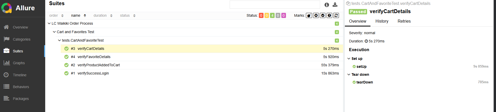

<h1 align="center">LC WAIKIKI WEB SITESI TEST OTOMASYONU </h1>

  

  

*~Burada projenin calisir halinin gif seklinde goruntusu acilacaktir , lutfen yuklenmediyse biraz bekleyiniz~*

### Bu proje, LC Waikiki web sitesinde urun satin alma prosesisin otomasyonunu gerceklestirmek icin hazirlanmistir.Amac,kullanicinin login olma,sepete urun ekleme sonrasinda da favorilere urun ekleme gibi islemlerin basariyla gerceklestigini gozlemlemek ve olasi hatalari tespit edebilmektir.Proje olusturulurken CLEAN ve SOLID prensiplerine uyulmaya calisarak , POM yapisinda gelistirme yapilmistir.

##  🚀 Kullanılan Teknolojiler

- **Java 17**: Projenin ana programlama dili.
- **Maven**: Proje yönetimi ve bağımlılık yönetimi için kullanıldı.
- **TestNG**: POM kullanilarak test senaryolarını yazmak ve yurutmek için kullanıldı.
- **Allure Reports**:Testlerin raporlanması için kullanıldı.

## 💻 Proje Yapısı

- **`src/main/java/pages/BasePage.java`**: BasePage abstract classıdir, kod tekrarını azaltır ve ortak methodlari barindirir.
- **`src/main/java/pages`**:Her page icin ayri locate ve methodlari barindirir
- **`src/main/java/utils`**: Driver ve ConfigReader gibi yardimci siniflari barindirir
- **`src/main/resources/media`**:Testin calismasini gosteren gifi ve rapor ekran goruntulerini icerir
- **`src/test/java/tests/BaseTest.java`**: BaseTest abstract classıdir icinde setUp ve tearDown gibi methodlari barinidir
- **`src/test/java/tests`**: UI testlerini barindirir
- **`pom.xml`**: Projede kullanılan tüm bağımlılıkları yöneten Maven yapılandırma dosyası.

## 🛠️ Kurulum ve Calistirma

1. **Bagimliliklari Yukleme**:
- Maven araciligiyla projenin bagimliliklarini indirmek icin `mvn clean install` komutunu calistirin

2. **Testleri Calistirma**:
- `src/test/java` altındaki tum testleri calistirmak icin `mvn clean test` komutunu calistirin.

##  ✅ Testler

- **verifySuccessLogin** : Kullanicin gecerli email ve gecerli sifre ile Lc Waikiki web sitesine giris yapabildigini dogrular
- **verifyProductAddedToCart** : Kullanicinin istedigi urun kategorilerine ulasarak acilan urunlerden istedigi urunu secerek sepete ekleyebildigini dogrular
- **verifyCartDetails** : Kullanicinin sepete ekledigi urun ile sepetteki urunun bilgilerinin eslestigini dogrular
- **verifyFavoriteDetails** : Kullanicinin favorilere ekledigi urun ile favorilerim sayfasindaki urunun bilgilerinin eslestigini dogrular

## 📊 Raporlama

- **Allure Report:** Test sonuçları Allure tarafından oluşturulan raporlarla belgelenebilir.Raporlari kendi localinizde acabilmek istiyorsaniz  `mvn allure:serve` komutunu calistirin

